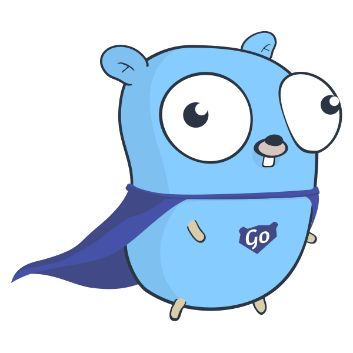
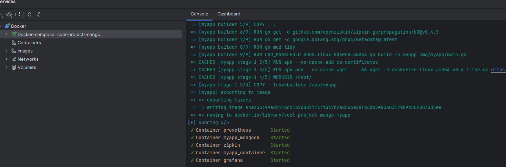
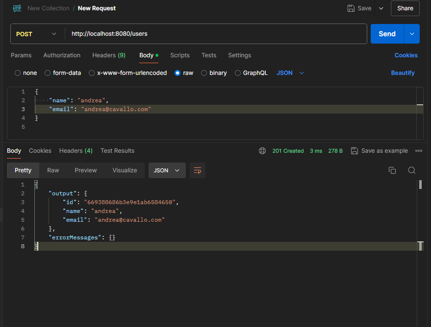
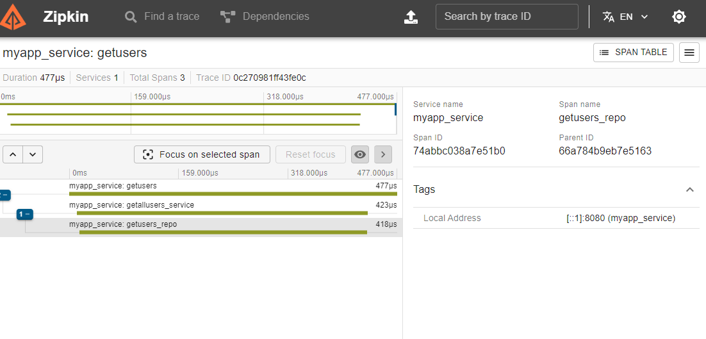
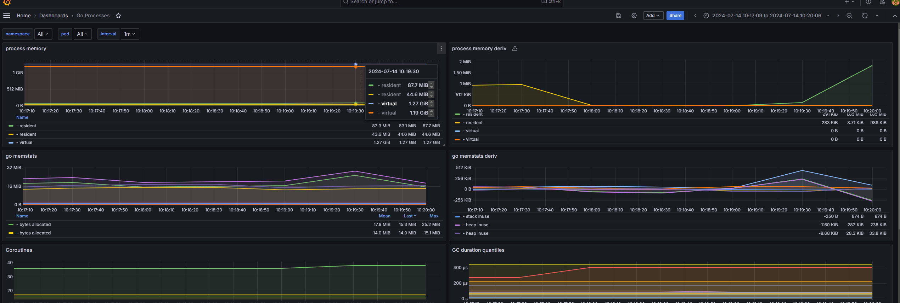
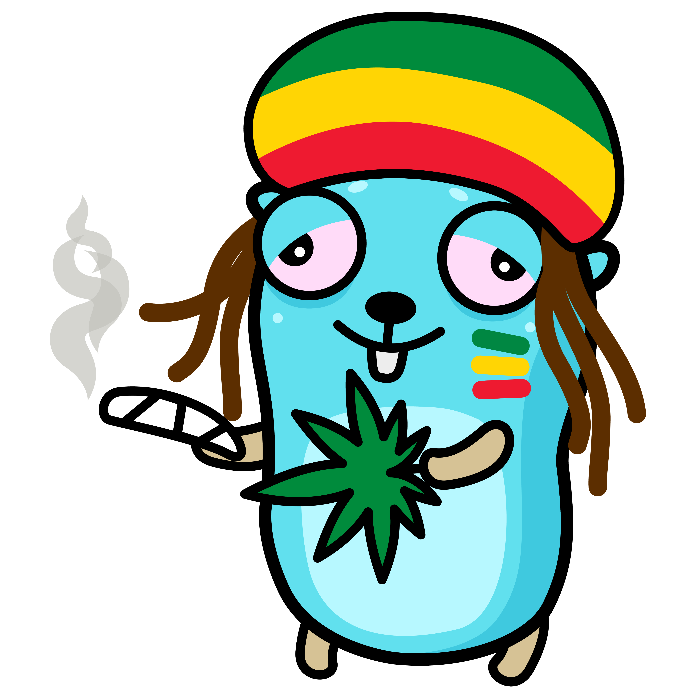

# Let's GO!!

## Introduzione

applicazione scritta in Go che espone delle REST API per la gestione degli utenti, utilizzando MongoDB come database. Il progetto segue una struttura modulare e organizzata, che facilita la manutenzione e la scalabilità.




## Struttura del Progetto

```plaintext
myapp/
├── main.go
└── internal/
    ├── config/
    │   └── mongodb_config.go
    ├── handlers/
    │   ├── metrics_handler.go
    │   └── user_handler.go
    ├── middleware/
    │   ├── correlation_middleware.go
    │   ├── error_handler_middleware.go
    │   ├── rate_limiter_middleware.go
    │   └── zipkin_middleware.go
    ├── models/
    │   └── user.go
    ├── repository/
    │   └── user_repository.go
    ├── router/
    │   └── router.go
    ├── services/
    │   └── user_service.go
    └── utils/
        └── logger.go
        └── utils.go

├── go.mod
└── go.sum
```

# Go Microservice

Questo progetto è un microservizio scritto in Go che utilizza MongoDB come database. Il microservizio espone API REST per la gestione di utenti. Il progetto include il tracciamento delle richieste tramite Zipkin, il monitoraggio con Prometheus e la visualizzazione dei dati di monitoraggio con Grafana.

## Architettura del Progetto


#### `main.go`
Il punto di ingresso principale dell'applicazione. Qui viene configurato e avviato il server, caricata la configurazione, e inizializzato il tracer di Zipkin.

#### `internal/config/mongodb_config.go`
Contiene la logica per la configurazione e connessione al database MongoDB.

#### `internal/handlers/`
Contiene i gestori (handlers) HTTP che rispondono alle richieste degli utenti.

- `metrics_handler.go`: Gestore per le metriche dell'applicazione.
- `user_handler.go`: Gestore per le operazioni relative agli utenti (es. creazione, lettura, aggiornamento e cancellazione).

#### `internal/middleware/`
Contiene il middleware utilizzato per elaborare le richieste HTTP prima che raggiungano i gestori.

- `correlation_middleware.go`: Middleware per aggiungere un ID di correlazione a ciascuna richiesta.
- `error_handler_middleware.go`: Middleware per gestire gli errori globali dell'applicazione.
- `rate_limiter_middleware.go`: Middleware per limitare il numero di richieste in un intervallo di tempo.
- `zipkin_middleware.go`: Middleware per tracciare le richieste utilizzando Zipkin.

#### `internal/models/`
Contiene i modelli di dati utilizzati nell'applicazione.

- `user.go`: Definisce la struttura dati per un utente.

#### `internal/repository/`
Contiene la logica per l'accesso ai dati e l'interazione con il database.

- `user_repository.go`: Contiene le funzioni per operare sui dati degli utenti nel database.

#### `internal/router/`
Contiene la logica per configurare e inizializzare le rotte dell'applicazione.

- `router.go`: Configura tutte le rotte dell'applicazione e applica i middleware.

#### `internal/services/`
Contiene la logica di business dell'applicazione.

- `user_service.go`: Contiene le funzioni di servizio per la gestione degli utenti.

#### `internal/utils/`
Contiene funzioni di utilità e il logger per l'applicazione.

- `logger.go`: Configura il logger per scrivere sia su console che su file.
- `utils.go`: Contiene funzioni di utilità come la generazione di UUID, la chiusura del corpo della richiesta e la risposta JSON.


## Prerequisiti

Assicurati di avere Docker e Docker Compose installati sul tuo sistema.

### Servizi Docker

- **MongoDB**: Utilizzato come database per memorizzare i dati degli utenti.
- **MyApp**: Il microservizio principale scritto in Go, che gestisce le operazioni CRUD sugli utenti.
- **Zipkin**: Utilizzato per tracciare le richieste attraverso il microservizio.
- **Prometheus**: Utilizzato per raccogliere metriche di monitoraggio dal microservizio.
- **Grafana**: Utilizzato per visualizzare le metriche raccolte da Prometheus.


## Come Eseguire il Microservizio

1. **Clona il repository**:
    ```sh
    git clone https://github.com/tuo-username/myapp.git
    cd myapp
    ```

2. **Esegui Docker Compose**:
    ```sh
    docker-compose up --build
    ```

   Questo comando avvierà i container Docker per l'applicazione Go e MongoDB.

## Testing dell'API con Postman

Per testare il microservizio, utilizza Postman o qualsiasi altro strumento per inviare richieste HTTP. Qui ci sono le richieste principali che puoi testare:

### Recupera tutti gli utenti

- **URL**: `http://localhost:8080/users`
- **Metodo**: GET
- **Descrizione**: Recupera tutti gli utenti.

### Crea un nuovo utente

- **URL**: `http://localhost:8080/users`
- **Metodo**: POST
- **Intestazioni**:
    - `Content-Type`: `application/json`
- **Body**:
    ```json
    {
        "name": "Andrea Cavallo",
        "email": "andrea.cavallo@email.it"
    }
    ```
- **Descrizione**: Crea un nuovo utente.

### Recupera un utente per ID

- **URL**: `http://localhost:8080/users/{id}`
- **Metodo**: GET
- **Descrizione**: Recupera un utente per ID. Sostituisci `{id}` con l'ID dell'utente.

### Elimina un utente per ID

- **URL**: `http://localhost:8080/users/{id}`
- **Metodo**: DELETE
- **Descrizione**: Elimina un utente per ID. Sostituisci `{id}` con l'ID dell'utente.

### Aggiorna un utente per ID

- **URL**: `http://localhost:8080/users/{id}`
- **Metodo**: PUT
- **Intestazioni**:
    - `Content-Type`: `application/json`
- **Body**:
    ```json
    {
        "name": "Andrea Cavallo",
        "email": "andrea.cavallo@nuovaemail.it"
    }
    ```
- **Descrizione**: Aggiorna un utente per ID. Sostituisci `{id}` con l'ID dell'utente.

## Zipkin


Nell'immagine sopra, vediamo una trace di esempio per l'endpoint `getusers`. La trace mostra il tempo totale impiegato dalla richiesta e suddivide questo tempo tra vari span figli. Ecco una descrizione dettagliata degli span:

- **Span principale: `myapp_service: getusers`**
    - **Durata totale:** 477µs
    - Questo span rappresenta l'intera durata della richiesta `getusers`.

- **Span figlio 1: `myapp_service: getallusers_service`**
    - **Durata:** 423µs
    - Questo span rappresenta il tempo impiegato dal servizio per recuperare tutti gli utenti.

- **Span figlio 2: `myapp_service: getusers_repo`**
    - **Durata:** 418µs
    - Questo span rappresenta il tempo impiegato dal repository per interagire con il database MongoDB e ottenere i dati degli utenti.


## Metrics - Prometheus

Il microservizio espone metriche Prometheus all'endpoint /metrics. Queste metriche forniscono informazioni dettagliate sulle prestazioni e sullo stato dell'applicazione.


## Visualizzazione delle Metriche con Grafana

Utilizziamo Grafana per visualizzare e analizzare le metriche raccolte da Prometheus. Grafana offre una vasta gamma di opzioni di visualizzazione per monitorare lo stato del sistema e delle applicazioni in tempo reale.

### Dashboard di Esempio

La seguente immagine mostra una dashboard di Grafana che visualizza varie metriche del microservizio:



### Descrizione della Dashboard

1. **Process Memory**:
    - **Resident**: Memoria residente attualmente in uso.
    - **Virtual**: Memoria virtuale allocata dal processo.
    - **Grafico Derivato**: Mostra la derivata della memoria di processo per identificare cambiamenti nel tempo.

2. **Go Memstats**:
    - **Bytes Allocated**: Numero di byte attualmente allocati.
    - **Grafico Derivato**: Mostra la derivata delle statistiche di memoria di Go per analizzare l'allocazione e il rilascio di memoria.

3. **Goroutines**:
    - Numero di goroutine attualmente attive.

4. **GC Duration Quantiles**:
    - Quantili della durata delle pause di garbage collection, fornendo una vista statistica delle performance del GC.

### Utilità della Visualizzazione

Grazie a queste visualizzazioni, possiamo:

- Monitorare l'utilizzo della memoria del processo nel tempo.
- Analizzare l'allocazione della memoria di Go e il comportamento del garbage collector.
- Tenere traccia del numero di goroutine per identificare potenziali problemi di concorrenza.
- Visualizzare le performance complessive dell'applicazione e individuare colli di bottiglia.




## Autore

Andrea Cavallo